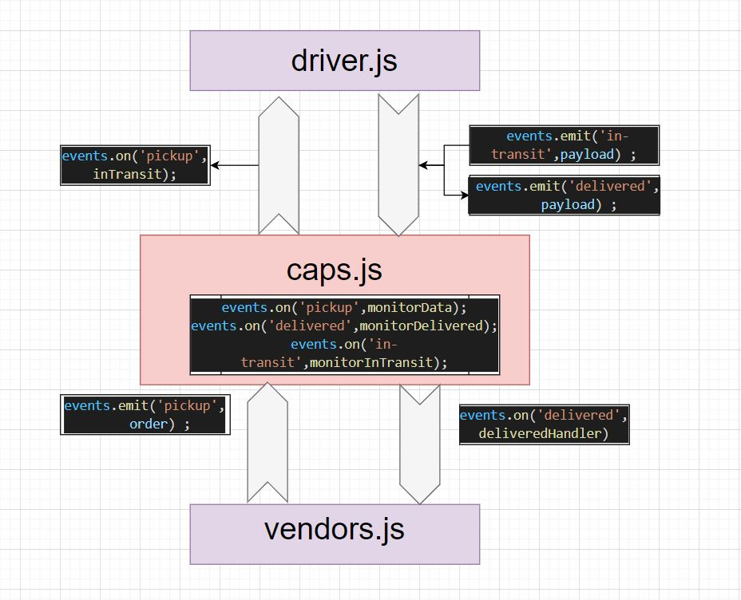

# CAPS

CAPS will simulate a delivery service where vendors (such a flower shops) will ship products using our delivery service and when our drivers deliver them, be notified that their customers received what they purchased.

### Auhtor : Tamara Alrashed

### [RepoLink]() 

### [PR]()

 

### Setup
`.env`
 
STORE_NAME 

 

### Running the app

`npm start`
 

### UML
 

